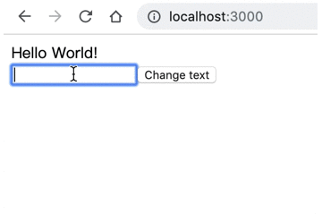

# React Hook

Hook 是 React 16.8 的新增特性。它可以让你在不编写 class 的情况下使用 state 以及其他的 React 特性。

1. [demo01 useState](#demo01) 

## demo01

React 是支持函数式编程的但是完全的函数式编程在这之前还无法做到。

比如需要用到 state 的时候就不能用纯函数组件，必须使用 class 来声明组件。

useState 可以让我们在不使用 class 的情况下编写有状态组件。

例如:

```jsx
// 引入 React 以及 useState
import React, { useState } from 'react';

import ReactDOM from 'react-dom';


function App() {
  // 'Hello World!' 是一个名为 text 的常量 (Model) 我们期望由它得到的是 <div>Hello World!</div> (View)。
  //  setText 是修改 text 的唯一方式 text 一旦被修改 意味着对应的 View 也就随之变化。
  const [text, setText] = useState('Hello World!');
  
  let inputText = '';

  return (
    <div>
       <div>{text}</div>
       <input onInput={(event)=>{inputText = event.target.value}}/>
       <button onClick={()=>{ setText(inputText) }}>Change text</button>
    </div>
  )
}

ReactDOM.render(<App/>, document.getElementById('root'))
```

运行效果:



在线浏览:

[react-hook-useState](https://pschina.github.io/react-hook/demo01/)

## 环境搭建

全局环境

1. 下载nodejs

2. 使用 npm 全局安装 webpack-cli 

```bash
sudo npm i webpack-cli -g
```

3. 全局安装 webpack 和 webpack-dev-server

```bash
sudo npm i webpack webpack-dev-server -g
```

4. 安装局部依赖

```json
{
  "devDependencies": {
    "@babel/core": "^7.5.5",
    "@babel/preset-env": "^7.5.5",
    "@babel/preset-react": "^7.0.0",
    "babel-loader": "^8.0.6",
    "css-loader": "^3.2.0",
    "html-loader": "^0.5.5",
    "html-webpack-plugin": "^3.2.0",
    "style-loader": "^1.0.0",
    "webpack": "^4.39.3",
    "webpack-cli": "^3.3.7",
    "webpack-dev-server": "^3.8.0"
  },
  "dependencies": {
    "react": "^16.9.0",
    "react-dom": "^16.9.0"
  }
}
```

```bash
npm i @babel/core @babel/preset-env @babel/preset-react babel-loader css-loader html-webpack-plugin style-loader webpack webpack-cli webpack-dev-server -D
```

```bash
npm i react react-dom -S
```

5. 新建 app.jsx 以及 index.html

app.jsx

```jsx
import React, {/* Your code */} from 'react';
import ReactDOM from 'react-dom';


function App() {
  /* Your code */
  return (
    <div>
      { /* Your code */ }
    </div>
  )
}

ReactDOM.render(<App/>, document.getElementById('root'))
```

index.html

```html
<!DOCTYPE html>
<html lang="en">
<head>
  <meta charset="UTF-8">
  <meta name="viewport" content="width=device-width, initial-scale=1.0">
  <meta http-equiv="X-UA-Compatible" content="ie=edge">
  <title>Document</title>
</head>
<body>
  <div id="root"></div>
</body>
</html>
```


6. 编写webpack.config.js

```js
const path = require('path')
const resolve = dir => path.resolve(__dirname,dir)
const HtmlWebpackPlugin = require('html-webpack-plugin');
module.exports = {
  entry:'./app.jsx',
  output:{
    path: resolve('dist'),
    filename: 'bundle.js'
  },
  module:{
    rules:[
      {
        test: /\.jsx?$/,
        use:[
          {
            loader:'babel-loader',
            options:{
              presets:[
                '@babel/env',
                '@babel/react'
              ]
            }
          }
        ]
      },
      {
        test: /\.html$/,
        use:['html-loader']
      },
      {
        test: /\.css$/,
        use:['style-loader','css-loader']
      },
      {
        test: /\.(png|jpe?g|gif|svg|mp4|webm|ogg|mp3|wav|flac|aac|woff2?|eot|ttf|otf)/,
        use:[{
          loader:'url-loader',
          options:{
            limit:10000
          }
        }]
      }
    ],
  },
  devServer:{
    contentBase:__dirname,
    port:3000,
    open:true,
  },
  plugins:[
    new HtmlWebpackPlugin({
      template:'./index.html'
    })
  ]
}
```
